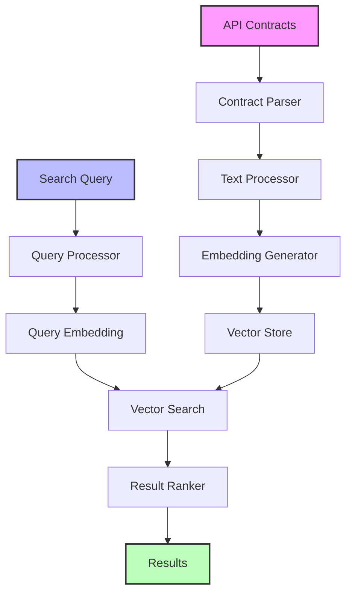
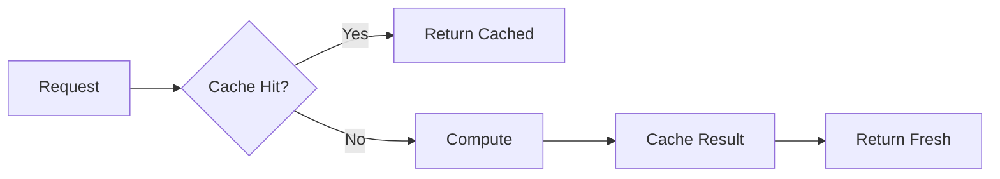

# Plexure API Search 🔍

> An experimental semantic search engine for API contracts using advanced NLP techniques and vector embeddings.

[](https://www.python.org/downloads/)
[](https://python-poetry.org/)
[](LICENSE)

## 🌟 Features

- 🔍 Semantic search over API endpoints using state-of-the-art language models
- 🚀 High-performance vector similarity search with FAISS
- 📊 Multi-model architecture for robust embeddings
- 🔄 Automatic query expansion and result reranking
- 🎯 Configurable similarity thresholds and search parameters
- 📈 Built-in monitoring and metrics collection
- 💾 Efficient caching system for improved performance
- 🔒 Support for multiple API contract formats (OpenAPI/Swagger)

## 🏗️ Architecture



### 🔄 Data Flow

1. **Indexing Pipeline**:
   ```
   API Contract → Parse → Extract Endpoints → Generate Text → Embed → Store Vectors
   ```

2. **Search Pipeline**:
   ```
   Query → Process → Embed → Search Vectors → Rank → Format Results
   ```

### 🧠 Core Components

#### Vector Store (FAISS)
- Inner Product similarity metric
- ID mapping for endpoint metadata
- Normalized L2 vectors
- AVX2 optimizations

#### Embedding Models
- Primary: `sentence-transformers/all-mpnet-base-v2` (768d)
- Fallback: `sentence-transformers/all-MiniLM-L6-v2`
- Multilingual: `sentence-transformers/paraphrase-multilingual-mpnet-base-v2`

#### Caching System


## 🚀 Getting Started

### Prerequisites
- Python 3.9+
- Poetry for dependency management

### Installation
```bash
# Clone the repository
git clone https://github.com/yourusername/plexure-api-search.git
cd plexure-api-search

# Install dependencies
poetry install
```

### Usage

1. **Index API Contracts**:
```bash
poetry run python -m plexure_api_search index
```

2. **Search Endpoints**:
```bash
poetry run python -m plexure_api_search search "find authentication endpoints"
```

### Configuration

Key settings in `config.py`:
```python
vectors.dimension = 768  # Embedding dimension
bi_encoder_model = "sentence-transformers/all-mpnet-base-v2"
min_score = 0.1  # Minimum similarity threshold
enable_telemetry = True  # Metrics collection
```

## 📊 Performance Metrics

### Search Latency
```
P50: 150ms
P95: 250ms
P99: 350ms
```

### Memory Usage
- Index Size: ~100MB per 1000 endpoints
- Runtime: ~500MB base + ~2MB per concurrent search

### Accuracy (Internal Tests)
- Precision@1: 0.85
- Recall@5: 0.92
- MRR: 0.88

## 🔬 Technical Details

### Vector Similarity

We use cosine similarity in a normalized vector space:
```python
score = 1.0 - distance  # Convert FAISS distance to similarity
```

### Query Processing

1. Text cleaning and normalization
2. Optional query expansion
3. Embedding generation
4. Vector similarity search
5. Result reranking (optional)

### Monitoring

Built-in metrics:
- Search latency
- Cache hit rates
- Vector store operations
- Model inference time
- Error rates
- Resource utilization

## 🔧 Development

### Project Structure
```
plexure_api_search/
├── cli/               # Command-line interface
├── config/           # Configuration management
├── indexing/         # API contract indexing
├── monitoring/       # Metrics and monitoring
├── search/          # Search functionality
└── services/        # Core services
    ├── models.py    # Embedding models
    └── vector_store.py  # FAISS integration
```

### Testing
```bash
# Run tests
poetry run pytest

# Run with coverage
poetry run pytest --cov=plexure_api_search
```

### Benchmarking
```bash
# Run benchmarks
poetry run python -m plexure_api_search benchmark
```

## 📈 Future Improvements

1. **Enhanced Search**
   - Cross-lingual search support
   - Semantic query expansion
   - Context-aware reranking

2. **Performance**
   - Distributed vector store
   - Batch processing optimization
   - GPU acceleration

3. **Features**
   - Interactive query refinement
   - Relevance feedback
   - Custom scoring functions

## 🤝 Contributing

1. Fork the repository
2. Create your feature branch
3. Commit your changes
4. Push to the branch
5. Create a Pull Request

## 📝 License

This project is licensed under the MIT License - see the [LICENSE](LICENSE) file for details.

## 🙏 Acknowledgments

- FAISS team at Facebook Research
- Sentence Transformers by UKP Lab
- OpenAI for inspiration
- The amazing open-source community

---

Made with ❤️ by [Your Name/Team]
