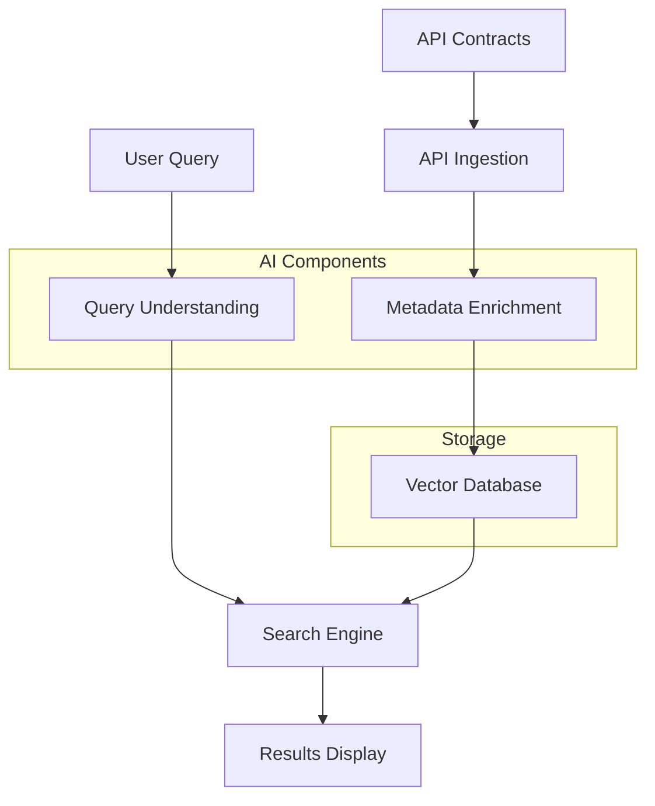

# 🔍 Plexure API Search Engine

A powerful semantic search engine for discovering and exploring APIs, enriched with AI-powered documentation and natural language understanding.

[](https://www.python.org/downloads/)
[](https://python-poetry.org/)
[](LICENSE)

## 🏗️ Architecture & Program Flow

### System Components



### Key Components

1. **API Ingestion** (`load_api_contracts`, `extract_endpoints`)
   - Reads OpenAPI/Swagger YAML files
   - Parses contract structure
   - Extracts endpoints and metadata
   - Validates contract format

2. **Metadata Enrichment** (`APIEnrichment`)
   - Uses LLM to enhance API documentation
   - Generates example requests/responses
   - Adds use cases and best practices
   - Provides security and performance insights
   - Implements retry mechanism for reliability
   - Falls back to synthetic data if LLM fails

3. **Vector Database** (Pinecone)
   - Stores API embeddings
   - Enables semantic search
   - Supports hybrid filtering
   - Manages metadata indexing

4. **Query Understanding** (`QueryUnderstanding`)
   - Parses natural language queries
   - Extracts search parameters
   - Identifies filters and preferences
   - Converts to structured format

5. **Search Engine** (`APISearchEngine`)
   - Combines semantic and metadata search
   - Ranks results by relevance
   - Applies filters and scoring
   - Manages search lifecycle

6. **Results Display** (`display_results`)
   - Formats search results
   - Shows rich metadata
   - Provides usage examples
   - Highlights important information

### Program Flow

1. **Initialization Phase**
   ```mermaid
   sequenceDiagram
       participant User
       participant Program
       participant Pinecone
       participant OpenRouter
       
       User->>Program: Start program
       Program->>Program: Load environment
       Program->>Pinecone: Initialize connection
       Program->>Program: Parse arguments
       alt Force Reindex
           Program->>Program: Load API contracts
           Program->>OpenRouter: Enrich metadata
           Program->>Pinecone: Index endpoints
       end
   ```

2. **Search Phase**
   ```mermaid
   sequenceDiagram
       participant User
       participant Program
       participant LLM
       participant Pinecone
       
       User->>Program: Submit query
       alt Natural Language Query
           Program->>LLM: Parse query
           LLM->>Program: Structured parameters
       end
       Program->>Pinecone: Search vectors
       Pinecone->>Program: Raw results
       Program->>Program: Format results
       Program->>User: Display results
   ```

### Data Flow

1. **API Contract Processing**
   ```
   YAML File → Parse Contract → Extract Endpoints → Enrich Metadata → Index
   ```

2. **Query Processing**
   ```
   User Query → Natural Language Understanding → Structured Query → Vector Search → Format Results
   ```

3. **Metadata Enrichment**
   ```
   Raw Endpoint → LLM Analysis → Enhanced Documentation → Validation → Storage
   ```

### Error Handling

The system implements robust error handling at multiple levels:

1. **API Ingestion**
   - Invalid YAML handling
   - Missing file detection
   - Contract validation

2. **LLM Integration**
   - Retry mechanism (3 attempts)
   - JSON validation
   - Fallback to synthetic data
   - Rate limiting handling

3. **Search Operations**
   - Query validation
   - Score thresholding
   - Results sanitization

4. **Vector Operations**
   - Connection error handling
   - Index validation
   - Upsert batching

### Performance Considerations

1. **Indexing**
   - Batch processing for efficiency
   - Parallel enrichment where possible
   - Incremental updates support

2. **Search**
   - Query optimization
   - Result caching
   - Hybrid search balancing

3. **Resource Usage**
   - Connection pooling
   - Memory-efficient processing
   - Timeout handling

## ✨ Features

### 🎯 Smart API Discovery
- **Semantic Search**: Find APIs based on meaning, not just keywords
- **Natural Language Queries**: Search using plain English (e.g., "find APIs with highest availability")
- **Hybrid Search**: Combines semantic understanding with metadata filtering
- **Rich Metadata**: Comprehensive API information including performance metrics, security details, and best practices

### 🤖 AI-Powered Documentation
- **Automatic Enrichment**: AI-generated documentation for clearer understanding
- **Example Generation**: Realistic request/response examples
- **Use Case Identification**: Suggested applications and business domains
- **Security Analysis**: Automated security considerations and best practices
- **Performance Insights**: Expected latency, throughput, and resource usage metrics

### 📊 Advanced Filtering & Analysis
- **Method Filtering**: Filter by HTTP method (GET, POST, etc.)
- **Tag-based Search**: Find APIs by category or domain
- **Performance Metrics**: Filter by availability, latency, and error rates
- **Lifecycle State**: Focus on stable, beta, or deprecated APIs
- **Smart Ranking**: Results ranked by relevance and quality metrics

## 🚀 Getting Started

### Prerequisites

- Python 3.8 or higher
- [Poetry](https://python-poetry.org/) for dependency management
- OpenRouter API key for AI features
- Pinecone API key for vector search

### Installation

1. Clone the repository:
```bash
git clone https://github.com/yourusername/plexure-api-search.git
cd plexure-api-search
```

2. Install dependencies with Poetry:
```bash
# Install Poetry if you haven't already
curl -sSL https://install.python-poetry.org | python3 -

# Install project dependencies
poetry install
```

3. Set up environment variables:
```bash
cp .env.example .env
```

Edit `.env` with your API keys:
```env
OPENROUTER_API_KEY=your_openrouter_key
PINECONE_API_KEY=your_pinecone_key
PINECONE_ENVIRONMENT=your_pinecone_environment
PINECONE_INDEX_NAME=your_index_name
```

### Quick Start

1. Index your API contracts:
```bash
poetry run python -m plexure_api_search --api-dir assets/apis --force-reindex
```

2. Search using natural language:
```bash
poetry run python -m plexure_api_search --query "find user authentication APIs" --natural
```

## 💡 Usage Examples

### Basic Search
```bash
# Simple keyword search
poetry run python -m plexure_api_search --query "user management"

# Filter by HTTP method
poetry run python -m plexure_api_search --query "create user" --method POST

# Set minimum similarity score
poetry run python -m plexure_api_search --query "payment processing" --min-score 0.7
```

### Natural Language Search
```bash
# Find high-availability APIs
poetry run python -m plexure_api_search --natural --query "find APIs with highest availability"

# Search with performance requirements
poetry run python -m plexure_api_search --natural --query "show me fast authentication APIs with low latency"

# Complex requirements
poetry run python -m plexure_api_search --natural --query "find stable payment APIs with good documentation and example code"
```

### Advanced Options
```bash
# Force reindexing of APIs
poetry run python -m plexure_api_search --force-reindex

# Skip indexing and use existing index
poetry run python -m plexure_api_search --skip-index

# Specify custom API directory
poetry run python -m plexure_api_search --api-dir /path/to/apis
```

## 🏗️ Project Structure

```
plexure-api-search/
├── plexure_api_search/
│   ├── __init__.py
│   └── __main__.py
├── assets/
│   └── apis/          # API contract files
├── pyproject.toml     # Poetry configuration and dependencies
├── poetry.lock       # Lock file for deterministic builds
├── .env
└── README.md
```

## 🛠️ Configuration

The search engine can be configured through environment variables or command-line arguments:

| Parameter | Environment Variable | Default | Description |
|-----------|---------------------|---------|-------------|
| API Directory | - | assets/apis | Directory containing API contracts |
| Min Score | - | 0.5 | Minimum similarity score (0-1) |
| Top K | - | 5 | Number of results to return |
| OpenRouter Key | OPENROUTER_API_KEY | - | API key for AI features |
| Pinecone Key | PINECONE_API_KEY | - | API key for vector search |

## 📝 API Contract Format

The search engine expects API contracts in YAML format following the OpenAPI/Swagger specification. Example:

```yaml
openapi: 3.0.0
info:
  title: User Management API
  version: 1.0.0
  description: API for managing user accounts
paths:
  /users:
    get:
      summary: List users
      description: Retrieve a list of users
      responses:
        200:
          description: Success
```

## 🤝 Contributing

Contributions are welcome! Please feel free to submit a Pull Request.

1. Fork the repository
2. Create your feature branch (`git checkout -b feature/AmazingFeature`)
3. Commit your changes (`git commit -m 'Add some AmazingFeature'`)
4. Push to the branch (`git push origin feature/AmazingFeature`)
5. Open a Pull Request

## 📄 License

This project is licensed under the MIT License - see the [LICENSE](LICENSE) file for details.

## 🙏 Acknowledgments

- [Pinecone](https://www.pinecone.io/) for vector search capabilities
- [OpenRouter](https://openrouter.ai/) for AI features
- [sentence-transformers](https://www.sbert.net/) for semantic embeddings
