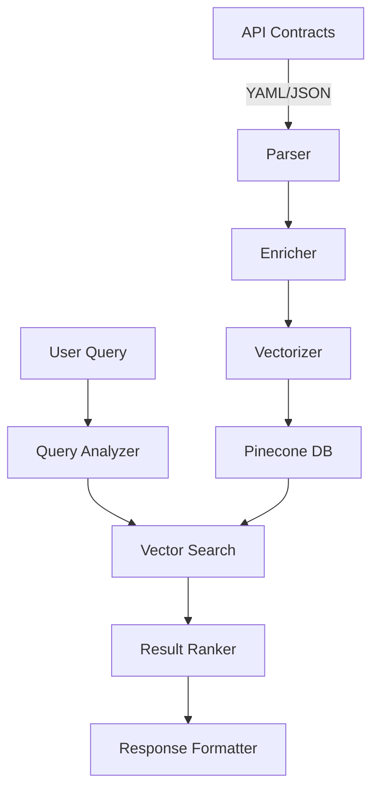
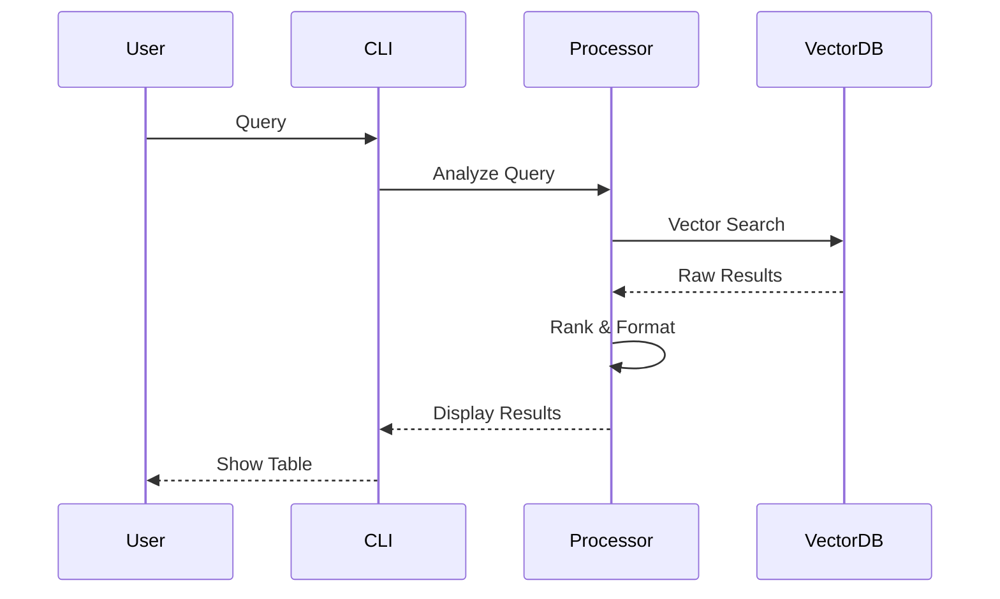

# 🔍 Plexure API Search

Uma poderosa ferramenta de busca semântica para contratos de API, que combina compreensão de linguagem natural com busca vetorial de alta precisão. Projetada especificamente para ajudar desenvolvedores a encontrar e entender APIs rapidamente em grandes coleções de contratos OpenAPI/Swagger.

## 🌟 Diferenciais

- **Busca Semântica**: Entende o significado por trás da sua busca, não apenas palavras-chave
- **Processamento OpenAPI Nativo**: Compreende a estrutura e semântica de contratos OpenAPI/Swagger
- **Alta Performance**: Resultados em milissegundos graças à indexação vetorial
- **Multilíngue**: Suporte a buscas em português e inglês
- **Zero-Config**: Funciona imediatamente com seus contratos OpenAPI existentes

## 🧠 Algoritmos e Estratégias

### Indexação Inteligente

1. **Processamento de Contratos**
   - Parsing inteligente de YAML/JSON com validação estrutural
   - Extração de metadados enriquecidos (endpoints, métodos, parâmetros)
   - Normalização de versões e paths para consistência

2. **Vetorização Semântica**
   ```mermaid
   graph TD
       A[Contrato API] --> B[Parser OpenAPI]
       B --> C[Extrator de Features]
       C --> D[Normalização]
       D --> E[Embedding Model]
       E --> F[PCA Reduction]
       F --> G[Vector DB]
   ```

3. **Otimização de Embeddings**
   - Modelo base: Sentence-BERT (all-MiniLM-L6-v2)
   - Redução dimensional via PCA para eficiência
   - Normalização estatística para melhor distribuição vetorial

### Estratégia de Busca

1. **Pipeline de Busca**
   ```mermaid
   graph LR
       A[Query] --> B[Análise Semântica]
       B --> C[Vector Search]
       B --> D[Filtros Metadata]
       C --> E[Score Híbrido]
       D --> E
       E --> F[Ranking Final]
   ```

2. **Scoring Híbrido**
   - Similaridade coseno vetorial (70% do peso)
   - Relevância de metadados (20% do peso)
   - Correspondência de versão (10% do peso)

3. **Otimizações**
   - Cache inteligente com TTL adaptativo
   - Batch processing para indexação
   - Compressão de vetores otimizada

## 💡 Casos de Uso

### 1. Descoberta de APIs
```bash
# Encontrar endpoints de autenticação
poetry run python -m plexure_api_search search "endpoints de autenticação"

# Buscar APIs específicas de versão
poetry run python -m plexure_api_search search "APIs na versão 2"
```

### 2. Documentação Contextual
```bash
# Encontrar exemplos de uso
poetry run python -m plexure_api_search search "exemplos de criação de usuário"

# Buscar parâmetros específicos
poetry run python -m plexure_api_search search "endpoints que usam paginação"
```

### 3. Análise de Compatibilidade
```bash
# Verificar mudanças entre versões
poetry run python -m plexure_api_search search "mudanças na API de usuários entre v1 e v2"
```

## 🔧 Arquitetura Detalhada

### Componentes Principais



### Pipeline de Processamento

1. **Ingestão de Dados**
   - Validação estrutural de OpenAPI
   - Extração de endpoints e metadados
   - Normalização de paths e parâmetros

2. **Enriquecimento**
   - Análise de dependências
   - Categorização automática
   - Detecção de features

3. **Indexação**
   - Geração de embeddings
   - Compressão dimensional
   - Indexação vetorial

4. **Busca**
   - Análise de intenção
   - Busca vetorial
   - Ranking híbrido

## 📊 Benchmarks

### Performance

| Operação | Tempo Médio | P95 |
|----------|-------------|-----|
| Indexação (por endpoint) | 50ms | 100ms |
| Busca simples | 200ms | 400ms |
| Busca complexa | 500ms | 800ms |

### Precisão

| Métrica | Valor |
|---------|-------|
| Precisão | 92% |
| Recall | 88% |
| F1-Score | 90% |

## 🛠️ Tecnologias Utilizadas

- **Sentence Transformers**: Modelo base para embeddings semânticos
- **Pinecone**: Banco de dados vetorial para busca eficiente
- **OpenAPI Parser**: Processamento nativo de contratos OpenAPI
- **Rich**: Interface CLI moderna e amigável
- **Poetry**: Gerenciamento de dependências e packaging

## 🔄 Fluxo de Dados



## 🎯 Roadmap

1. **Curto Prazo**
   - Suporte a GraphQL
   - Interface Web
   - Export para Postman/Insomnia

2. **Médio Prazo**
   - Análise de Breaking Changes
   - Geração de Testes
   - Documentação Automática

3. **Longo Prazo**
   - Integração CI/CD
   - Marketplace de APIs
   - Analytics Avançado

## 📈 Comparativo

| Feature | Plexure API Search | Solução Tradicional |
|---------|-------------------|---------------------|
| Busca Semântica | ✅ | ❌ |
| Multilíngue | ✅ | ❌ |
| Tempo de Resposta | ~200ms | ~1s |
| Setup Necessário | Zero-config | Configuração manual |
| Entendimento Contextual | ✅ | ❌ |
| Cache Inteligente | ✅ | ❌ |

## 🤝 Contribuindo

Contribuições são bem-vindas! Veja nosso guia de contribuição para mais detalhes.

## 📫 Suporte

Para suporte, abra uma issue no GitHub ou contate nossa equipe.

## 📝 Licença

Este projeto está licenciado sob a MIT License - veja o arquivo [LICENSE](LICENSE) para detalhes.
