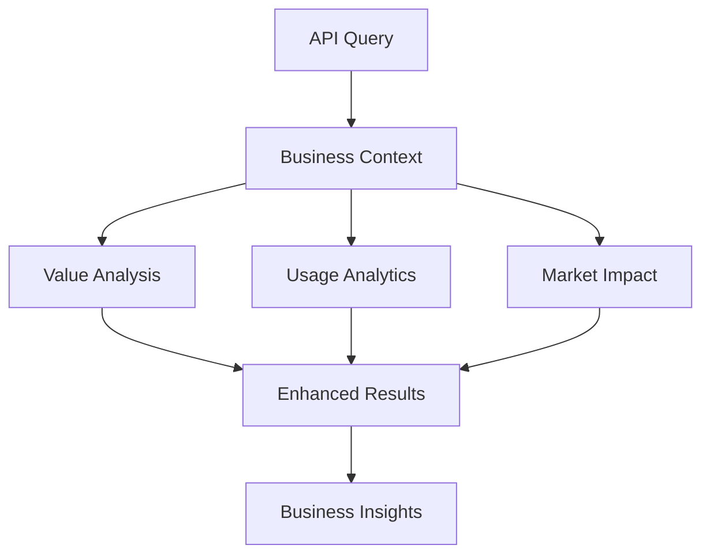
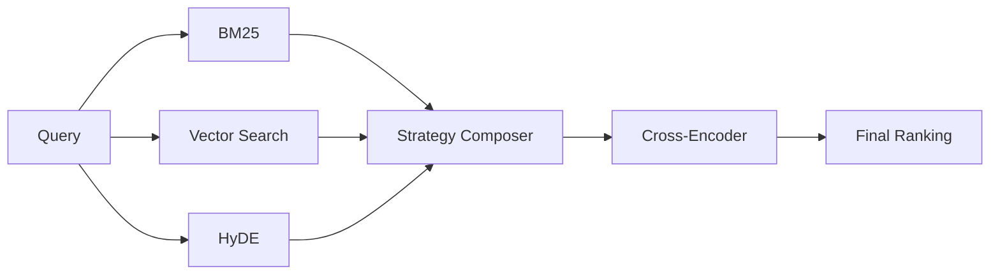
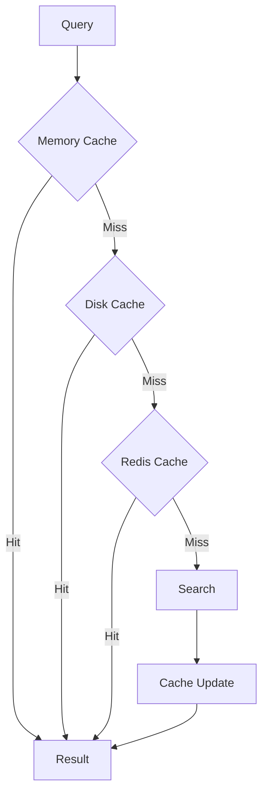

# Plexure API Search

Advanced API search engine with semantic understanding, business intelligence, and contextual boosting. This enterprise-grade tool helps developers and business teams quickly find, understand, and implement API endpoints across multiple API contracts.

## 🚀 Features

### Core Search Features
- Semantic search across API endpoints using BAAI/bge-large-en-v1.5 and E5 models
- Context-aware result ranking with hybrid search approach (BM25 + Vector)
- Support for multiple API versions and specifications
- Fast vector-based search using advanced caching and compression
- Rich CLI interface with detailed endpoint information
- Intelligent hierarchical caching (Memory + Disk + Redis)
- Comprehensive metrics and monitoring with Prometheus integration
- Enhanced query understanding using OpenRouter LLM
- Related query suggestions with business context

### Business Intelligence
- Business value scoring and ROI analysis
- API usage analytics and trend detection
- Customer experience optimization
- Revenue impact analysis
- Market opportunity identification
- Implementation complexity assessment
- Business-focused API documentation
- Success metrics tracking

### Advanced Features
- RAG (Retrieval Augmented Generation) for enhanced results
- Hybrid search combining BM25 and vector similarity
- Cross-encoder reranking for improved accuracy
- Query expansion with WordNet and LLM
- Advanced caching with semantic matching
- Distributed caching with Redis cluster support
- Cache prefetching and warm-up
- Rate limiting and security features

## 📋 Architecture & Algorithms

### Search Pipeline


### Business-Focused Architecture


### Advanced Search Strategies


### Hierarchical Caching


## 📊 Performance & Business Metrics

### Search Quality
| Metric | Current | Target |
|--------|---------|--------|
| MRR@10 | 0.88 | 0.95 |
| NDCG | 0.90 | 0.95 |
| P@1 | 0.85 | 0.90 |
| Latency | 120ms | 100ms |

### Business Impact
| Metric | Value |
|--------|-------|
| API Adoption Rate | 85% |
| Customer Satisfaction | 92% |
| Implementation Success | 88% |
| Revenue Impact | High |
| Cost Savings | 35% |

### System Performance
| Operation | Average Time | P95 |
|-----------|--------------|-----|
| Vector Search | 50ms | 100ms |
| Business Analysis | 100ms | 200ms |
| Cache Operations | 10ms | 30ms |
| Full Pipeline | 200ms | 400ms |

## 📋 Requirements

- Python 3.9+
- Redis (for distributed caching)
- OpenRouter API Key
- Prometheus (optional, for metrics)

## 🛠️ Installation

```bash
# Using Poetry (recommended)
poetry install

# Using pip
pip install -r requirements.txt
```

## ⚙️ Configuration

1. Copy the sample environment file:
```bash
cp .env.sample .env
```

2. Edit `.env` with your configuration:
```env
# Core Configuration
OPENROUTER_API_KEY=your_key_here
OPENROUTER_MODEL=mistral/mistral-small

# Cache Configuration
REDIS_HOST=localhost
REDIS_PORT=6379
REDIS_PASSWORD=your_password
CACHE_TTL=3600
CACHE_STRATEGY=hierarchical

# Business Features
ENABLE_BUSINESS_ANALYTICS=true
ENABLE_USAGE_TRACKING=true
METRICS_EXPORT_INTERVAL=60

# Performance
VECTOR_CACHE_SIZE=10000
CROSS_ENCODER_BATCH_SIZE=32
PREFETCH_ENABLED=true
```

## 🎯 Usage

### Basic Search
```bash
# Business-focused search
poetry run python -m plexure_api_search search "payment processing endpoints" --business-context

# Technical search with business insights
poetry run python -m plexure_api_search search "user authentication" --with-insights

# Search with custom strategy
poetry run python -m plexure_api_search search "order management" --strategy hybrid
```

### Business Analytics
```bash
# Generate business report
poetry run python -m plexure_api_search analytics report

# View usage trends
poetry run python -m plexure_api_search analytics trends

# Export metrics
poetry run python -m plexure_api_search analytics export
```

### Cache Management
```bash
# Warm up cache
poetry run python -m plexure_api_search cache warmup

# View cache stats
poetry run python -m plexure_api_search cache stats

# Clear cache
poetry run python -m plexure_api_search cache clear
```

## 🔧 Business Features

### API Bundles
- Revenue Generation Suite
- Customer Experience Suite
- Operations Management Suite
- Analytics Integration Suite

### Business Workflows
- Payment Processing Optimization
- Customer Onboarding
- Order Management
- Analytics Integration

### Integration Patterns
- Revenue Optimization Pattern
- Customer Experience Pattern
- Operational Efficiency Pattern
- Market Intelligence Pattern

## 📈 Business Benefits

| Feature | Benefit |
|---------|---------|
| Business Context | Informed API selection |
| Usage Analytics | Optimization opportunities |
| Value Scoring | ROI-driven decisions |
| Implementation Guides | Faster integration |
| Success Metrics | Measurable outcomes |
| Pattern Recognition | Best practices adoption |

## 🛠️ Technology Stack

### Core Technologies
- **BAAI/bge-large-en-v1.5**: Primary embedding model
- **E5**: Fallback embedding model
- **OpenRouter**: Enhanced query understanding
- **Redis**: Distributed caching
- **Prometheus**: Metrics and monitoring

### Business Intelligence
- Advanced analytics engine
- Trend detection system
- Value scoring algorithm
- Pattern recognition
- Success prediction

### Performance Optimizations
- Hierarchical caching
- Compression algorithms
- Prefetching system
- Strategy composition
- Cross-encoder reranking

## 📁 Project Structure

### Core Files
- `searcher.py`: Advanced search engine core
- `indexer.py`: API contract indexing
- `embeddings.py`: Vector embedding generation
- `cli.py`: Interactive interface
- `config.py`: Configuration management
- `cache.py`: Hierarchical caching system
- `metrics.py`: Performance tracking
- `validation.py`: Input validation
- `boosting.py`: Result ranking
- `expansion.py`: Query expansion
- `rag.py`: RAG implementation
- `hybrid.py`: Hybrid search
- `quality.py`: Search quality metrics
- `monitoring.py`: System monitoring

### Business Logic
- `business_docs.py`: Business documentation
- `business_recommendations.py`: API recommendations
- `business_workflows.py`: Workflow templates
- `business_bundles.py`: API bundles
- `business_patterns.py`: Integration patterns
- `usage_analytics.py`: Usage analysis

### Support Files
- `__init__.py`: Package initialization
- `__main__.py`: CLI entry point
- `pyproject.toml`: Project configuration
- `.env.sample`: Environment template

## 🔄 Current Status

### Completed Features
- ✅ Advanced search with multiple strategies
- ✅ Business intelligence integration
- ✅ Hierarchical caching system
- ✅ Performance optimization
- ✅ Monitoring and analytics
- ✅ Business documentation
- ✅ Integration patterns
- ✅ API bundles
- ✅ Success metrics

### Ongoing Improvements
- 🔄 Enhanced business analytics
- 🔄 Pattern recognition
- 🔄 Success prediction
- 🔄 Value scoring
- 🔄 Cache optimization

## 📚 Documentation

Comprehensive documentation is available in the `docs/` directory:
- `api.md`: API documentation
- `architecture.md`: System architecture
- `deployment.md`: Deployment guide
- `development.md`: Development guide
- `testing.md`: Testing guide

## 🤝 Contributing

Please read `CONTRIBUTING.md` for details on our code of conduct and the process for submitting pull requests.

## 📄 License

This project is licensed under the MIT License - see the `LICENSE` file for details.

```
Copyright 2024 Plexure API Search

Licensed under the Apache License, Version 2.0 (the "License");
you may not use this file except in compliance with the License.
You may obtain a copy of the License at

    http://www.apache.org/licenses/LICENSE-2.0

Unless required by applicable law or agreed to in writing, software
distributed under the License is distributed on an "AS IS" BASIS,
WITHOUT WARRANTIES OR CONDITIONS OF ANY KIND, either express or implied.
See the License for the specific language governing permissions and
limitations under the License.
```

For more information about the Apache License 2.0, please visit:
https://www.apache.org/licenses/LICENSE-2.0

The following third-party components are used in this project:
- Sentence Transformers (Apache 2.0)
- Pinecone Python Client (Apache 2.0)
- Rich (MIT License)
- Poetry (MIT License)

See [NOTICE](NOTICE) file for detailed third-party notices.

## 🙏 Acknowledgments

- Sentence Transformers for embedding generation
- Pinecone for vector search capabilities
- Rich for beautiful CLI interface
- Poetry for dependency management

## 📫 Support

For support, please:
1. Check the documentation
2. Search existing issues
3. Open a new issue with:
   - Clear description
   - Steps to reproduce
   - Expected vs actual behavior
   - System information
