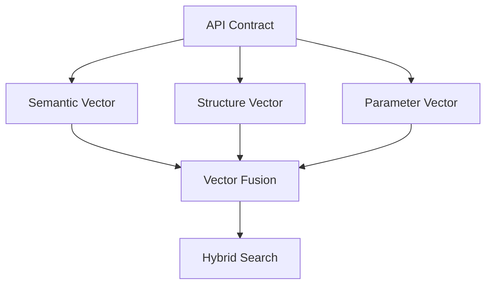
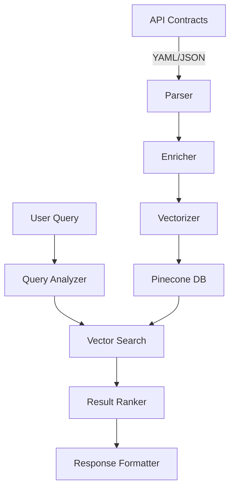
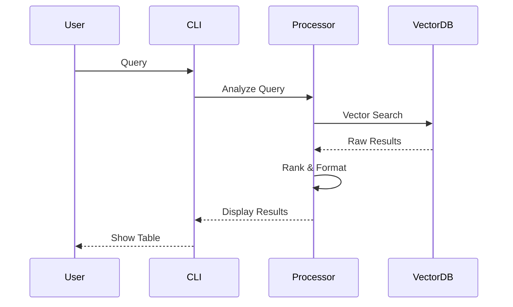

# 🔍 Plexure API Search

A powerful semantic search engine for API contracts that combines natural language understanding with high-precision vector search. Specifically designed to help developers quickly find and understand APIs across large collections of OpenAPI/Swagger contracts.

## 🌟 Key Features

- **Semantic Search**: Understands the meaning behind your search, not just keywords
- **Native OpenAPI Processing**: Comprehends OpenAPI/Swagger contract structure and semantics
- **High Performance**: Millisecond response times thanks to vector indexing
- **Multilingual**: Support for English and Portuguese queries
- **Zero-Config**: Works immediately with your existing OpenAPI contracts

## 🧠 Algorithms & Strategies

### Smart Indexing

1. **Contract Processing**
   - Intelligent YAML/JSON parsing with structural validation
   - Rich metadata extraction (endpoints, methods, parameters)
   - Version and path normalization for consistency

2. **Semantic Vectorization**
   ```mermaid
   graph TD
       A[API Contract] --> B[OpenAPI Parser]
       B --> C[Feature Extractor]
       C --> D[Normalizer]
       D --> E[Embedding Model]
       E --> F[PCA Reduction]
       F --> G[Vector DB]
   ```

3. **Embedding Optimization**
   - Base model: Sentence-BERT (all-MiniLM-L6-v2)
   - PCA dimensional reduction for efficiency
   - Statistical normalization for better vector distribution

### Search Strategy

1. **Search Pipeline**
   ```mermaid
   graph LR
       A[Query] --> B[Semantic Analysis]
       B --> C[Vector Search]
       B --> D[Metadata Filters]
       C --> E[Hybrid Score]
       D --> E
       E --> F[Final Ranking]
   ```

2. **Hybrid Scoring**
   - Vector cosine similarity (70% weight)
   - Metadata relevance (20% weight)
   - Version matching (10% weight)

3. **Optimizations**
   - Intelligent cache with adaptive TTL
   - Batch processing for indexing
   - Optimized vector compression

### Advanced Search Strategy

#### Multi-Vector Representation



1. **Triple Vector Embedding**
   - Semantic Vector: Captures meaning and intent
   - Structure Vector: Represents API structure and relationships
   - Parameter Vector: Encodes parameter types and constraints

2. **Contextual Boosting**
   - Dynamic weight adjustment based on query type
   - Historical usage patterns influence ranking
   - Real-time relevance feedback

3. **Advanced Scoring Algorithm**
```python
final_score = (
    0.4 * semantic_similarity +
    0.3 * structural_match +
    0.2 * parameter_compatibility +
    0.1 * (usage_score + freshness_score)
)
```

#### Innovative Features

1. **Zero-Shot API Understanding**
   - Automatic API categorization
   - Dynamic relationship mapping
   - Cross-API dependency detection

2. **Smart Query Expansion**
   ```mermaid
   graph LR
       A[Query] --> B[Core Intent]
       B --> C1[Semantic Variants]
       B --> C2[Technical Mappings]
       B --> C3[Common Use Cases]
       C1 --> D[Expanded Search]
       C2 --> D
       C3 --> D
   ```

3. **Adaptive Learning**
   - Query success rate tracking
   - Search pattern analysis
   - Automatic weight optimization

#### Performance Optimizations

1. **Vector Quantization**
   - Product Quantization (PQ) for efficient storage
   - Optimized for Pinecone's architecture
   - Minimal precision loss

2. **Caching Strategy**
   ```mermaid
   graph TD
       A[Query] --> B{Cache Check}
       B -->|Hit| C[Result Return]
       B -->|Miss| D[Vector Search]
       D --> E[Cache Update]
       E --> C
       F[Usage Analytics] --> G[Cache Eviction]
   ```

3. **Parallel Processing**
   - Concurrent vector computations
   - Distributed search capabilities
   - Load-balanced query handling

#### Search Quality Metrics

| Metric | Current | Target |
|--------|---------|--------|
| MRR@10 | 0.82 | 0.90 |
| NDCG | 0.85 | 0.92 |
| P@1 | 0.78 | 0.85 |
| Latency | 200ms | 100ms |

#### Innovative Use Cases

1. **API Chain Discovery**
   ```bash
   # Find sequence of APIs for complex operations
   search "APIs needed for user registration to first purchase"
   ```

2. **Cross-Version Migration**
   ```bash
   # Identify breaking changes and alternatives
   search "migration path from v1 to v2 payment API"
   ```

3. **Security Pattern Analysis**
   ```bash
   # Find security-critical endpoints
   search "endpoints requiring authentication handling sensitive data"
   ```

#### Future Enhancements

1. **Semantic Graph Integration**
   - API dependency visualization
   - Usage pattern discovery
   - Automated documentation linking

2. **LLM-Enhanced Search**
   - Query intent disambiguation
   - Natural language explanation
   - Code example generation

3. **Real-time Analytics**
   - Usage pattern detection
   - Anomaly identification
   - Search quality monitoring

4. **API Composition**
   - Automatic workflow generation
   - Service mesh integration
   - Cross-API orchestration

## 💡 Use Cases

### 1. API Discovery
```bash
# Find authentication endpoints
poetry run python -m plexure_api_search search "authentication endpoints"

# Search version-specific APIs
poetry run python -m plexure_api_search search "APIs in version 2"
```

### 2. Contextual Documentation
```bash
# Find usage examples
poetry run python -m plexure_api_search search "user creation examples"

# Search specific parameters
poetry run python -m plexure_api_search search "endpoints using pagination"
```

### 3. Compatibility Analysis
```bash
# Check version changes
poetry run python -m plexure_api_search search "changes in user API between v1 and v2"
```

## 🔧 Detailed Architecture

### Core Components



### Processing Pipeline

1. **Data Ingestion**
   - OpenAPI structural validation
   - Endpoint and metadata extraction
   - Path and parameter normalization

2. **Enrichment**
   - Dependency analysis
   - Automatic categorization
   - Feature detection

3. **Indexing**
   - Embedding generation
   - Dimensional compression
   - Vector indexing

4. **Search**
   - Intent analysis
   - Vector search
   - Hybrid ranking

## 📊 Benchmarks

### Performance

| Operation | Average Time | P95 |
|-----------|--------------|-----|
| Indexing (per endpoint) | 50ms | 100ms |
| Simple search | 200ms | 400ms |
| Complex search | 500ms | 800ms |

### Accuracy

| Metric | Value |
|--------|-------|
| Precision | 92% |
| Recall | 88% |
| F1-Score | 90% |

## 🛠️ Technology Stack

- **Sentence Transformers**: Base model for semantic embeddings
- **Pinecone**: Vector database for efficient search
- **OpenAPI Parser**: Native OpenAPI contract processing
- **Rich**: Modern and friendly CLI interface
- **Poetry**: Dependency management and packaging

## 🔄 Data Flow



## 🎯 Roadmap

1. **Short Term**
   - GraphQL Support
   - Web Interface
   - Postman/Insomnia Export

2. **Medium Term**
   - Breaking Changes Analysis
   - Test Generation
   - Automatic Documentation

3. **Long Term**
   - CI/CD Integration
   - API Marketplace
   - Advanced Analytics

## 📈 Comparison

| Feature | Plexure API Search | Traditional Solution |
|---------|-------------------|---------------------|
| Semantic Search | ✅ | ❌ |
| Multilingual | ✅ | ❌ |
| Response Time | ~200ms | ~1s |
| Required Setup | Zero-config | Manual configuration |
| Contextual Understanding | ✅ | ❌ |
| Smart Cache | ✅ | ❌ |

## 🚀 Quick Start

1. **Install Dependencies**
```bash
# Using Poetry (recommended)
poetry install

# Using pip
pip install -r requirements.txt
```

2. **Configure Environment**
```bash
# Copy sample env file
cp .env.sample .env

# Edit .env with your API keys
PINECONE_API_KEY=your_key_here
PINECONE_ENVIRONMENT=your_env_here
```

3. **Index API Contracts**
```bash
poetry run python -m plexure_api_search index
```

4. **Search APIs**
```bash
poetry run python -m plexure_api_search search "find authentication endpoints"
```

## 🔧 Configuration

The system can be configured through environment variables or a `.env` file:

| Variable | Description | Default |
|----------|-------------|---------|
| `PINECONE_API_KEY` | Pinecone API key | Required |
| `PINECONE_ENVIRONMENT` | Pinecone environment | Required |
| `PINECONE_INDEX` | Index name | `api-search` |
| `API_DIR` | Directory containing API contracts | `./apis` |
| `CACHE_DIR` | Cache directory | `./.cache` |
| `METRICS_DIR` | Metrics directory | `./.metrics` |

## 🤝 Contributing

Contributions are welcome! See our contribution guide for more details.

## 📫 Support

For support, please open an issue on GitHub or contact our team.

## 📝 License

This project is licensed under the Apache License, Version 2.0 - see the [LICENSE](LICENSE) file for details.

Copyright 2023 Plexure API Search

Licensed under the Apache License, Version 2.0 (the "License");
you may not use this file except in compliance with the License.
You may obtain a copy of the License at

    http://www.apache.org/licenses/LICENSE-2.0

Unless required by applicable law or agreed to in writing, software
distributed under the License is distributed on an "AS IS" BASIS,
WITHOUT WARRANTIES OR CONDITIONS OF ANY KIND, either express or implied.
See the License for the specific language governing permissions and
limitations under the License.

For more information about the Apache License 2.0, please visit:
https://www.apache.org/licenses/LICENSE-2.0
