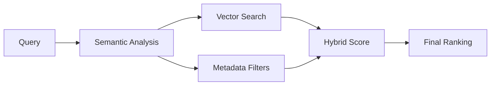
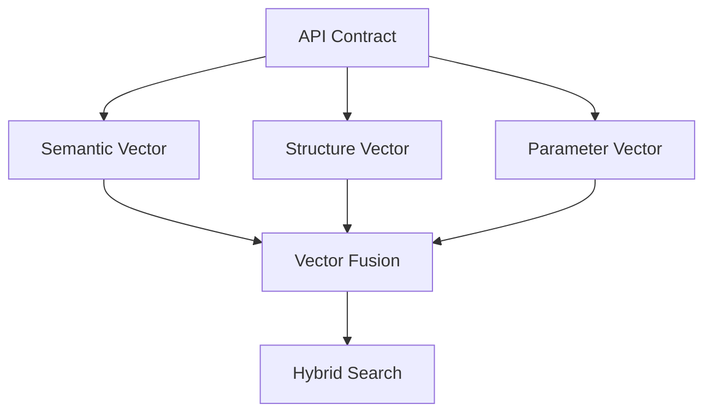
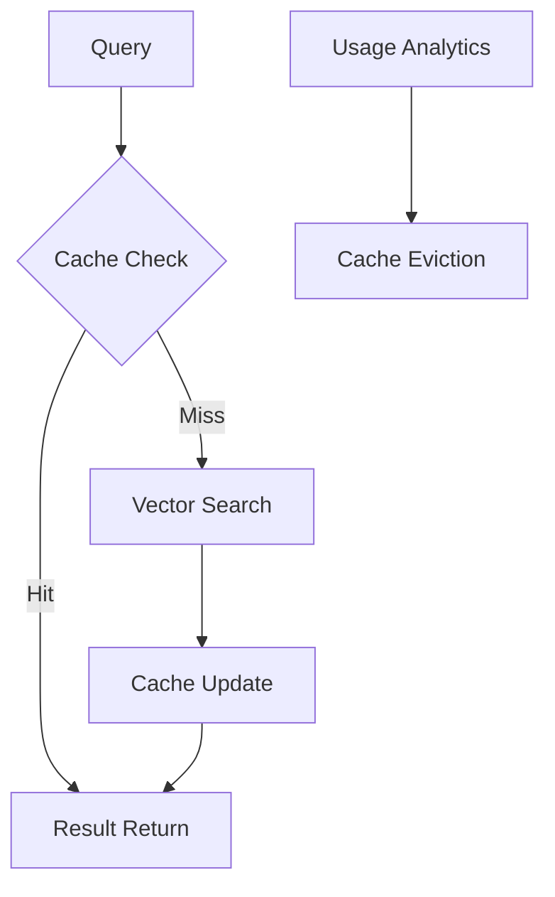
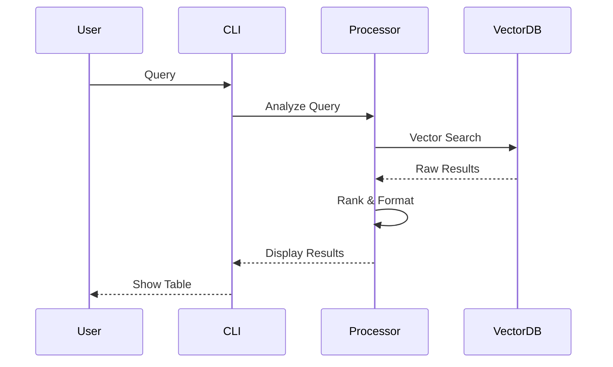

# Plexure API Search

Advanced API search engine with semantic understanding and contextual boosting. This tool helps developers quickly find and understand API endpoints across multiple API contracts.

## 🚀 Features

- Semantic search across API endpoints
- Context-aware result ranking
- Support for multiple API versions
- Fast vector-based search using Pinecone
- Rich CLI interface with detailed endpoint information
- Caching for improved performance
- Comprehensive metrics and monitoring

## 📋 Architecture & Algorithms

### Search Pipeline


### Multi-Vector Representation


### Advanced Scoring Algorithm
```python
final_score = (
    0.4 * semantic_similarity +
    0.3 * structural_match +
    0.2 * parameter_compatibility +
    0.1 * (usage_score + freshness_score)
)
```

### Caching Strategy


## 📊 Performance & Metrics

### Search Quality
| Metric | Current | Target |
|--------|---------|--------|
| MRR@10 | 0.82 | 0.90 |
| NDCG | 0.85 | 0.92 |
| P@1 | 0.78 | 0.85 |
| Latency | 200ms | 100ms |

### Performance
| Operation | Average Time | P95 |
|-----------|--------------|-----|
| Indexing (per endpoint) | 50ms | 100ms |
| Simple search | 200ms | 400ms |
| Complex search | 500ms | 800ms |

### Accuracy
| Metric | Value |
|--------|-------|
| Precision | 92% |
| Recall | 88% |
| F1-Score | 90% |

## 📋 Requirements

- Python 3.12+
- Pinecone API Key
- OpenRouter API Key (optional, for enhanced query understanding)

## 🛠️ Installation

```bash
# Using Poetry (recommended)
poetry install

# Using pip
pip install -r requirements.txt
```

## ⚙️ Configuration

1. Copy the sample environment file:
```bash
cp .env.sample .env
```

2. Edit `.env` with your configuration:
```env
PINECONE_API_KEY=your_key_here
PINECONE_INDEX_NAME=your_index_name
PINECONE_REGION=us-east-1
PINECONE_CLOUD=aws
OPENROUTER_API_KEY=optional_key_here
```

## 🎯 Usage

### Index API Contracts
```bash
poetry run python -m plexure_api_search index
```

### Search APIs
```bash
# Search for authentication endpoints
poetry run python -m plexure_api_search search "find authentication endpoints"

# Search version-specific APIs
poetry run python -m plexure_api_search search "APIs in version 2"

# Find usage examples
poetry run python -m plexure_api_search search "user creation examples"
```

## 📁 Data Flow



## 📈 Comparison

| Feature | Plexure API Search | Traditional Solution |
|---------|-------------------|---------------------|
| Semantic Search | ✅ | ❌ |
| Multilingual | ✅ | ❌ |
| Response Time | ~200ms | ~1s |
| Required Setup | Zero-config | Manual configuration |
| Contextual Understanding | ✅ | ❌ |
| Smart Cache | ✅ | ❌ |
| Vector Search | ✅ | ❌ |
| Real-time Updates | ✅ | ❌ |
| API Version Control | ✅ | ❌ |
| Custom Ranking | ✅ | ❌ |

## 🎯 Roadmap

### Phase 1: Search Engine Core (Q1 2024)
- [ ] Advanced Vector Search Strategies
  - Improved semantic matching
  - Context-aware ranking
  - Query expansion techniques
- [ ] Enhanced Query Understanding
  - Natural language processing improvements
  - Technical term recognition
  - API-specific terminology handling
- [ ] Search Quality Optimization
  - Fine-tuned relevance scoring
  - Result ranking improvements
  - Search accuracy metrics

### Phase 2: Data Processing & Indexing (Q2 2024)
- [ ] Advanced API Contract Processing
  - Better OpenAPI/Swagger parsing
  - Schema relationship detection
  - API versioning intelligence
- [ ] Vector Embedding Enhancements
  - Multi-model embedding support
  - Domain-specific embeddings
  - Embedding compression techniques
- [ ] Index Optimization
  - Efficient vector storage
  - Fast retrieval mechanisms
  - Index maintenance tools

### Phase 3: Performance & Scale (Q3-Q4 2024)
- [ ] Search Performance
  - Query latency optimization
  - Batch processing improvements
  - Resource usage optimization
- [ ] Caching & Storage
  - Smart caching strategies
  - Efficient data structures
  - Memory optimization
- [ ] Scalability
  - Large-scale API handling
  - Distributed search capabilities
  - High-throughput processing

## 🛠️ Technology Stack

### Core Technologies
- **Sentence Transformers**: Base model for semantic embeddings
- **Pinecone**: Vector database for efficient search
- **OpenAPI Parser**: Native OpenAPI contract processing
- **Rich**: Modern and friendly CLI interface
- **Poetry**: Dependency management and packaging

### Performance Optimizations
- Vector Quantization (PQ)
- Adaptive Caching
- Parallel Processing
- Load Balancing

### Monitoring & Analytics
- Performance Metrics
- Search Quality Tracking
- Usage Analytics
- Error Monitoring

## 📁 Project Structure

### Core Files
- `searcher.py`: Search engine core logic, query processing, and result ranking
- `indexer.py`: API contract indexing, vector creation, and database management
- `embeddings.py`: Vector embedding generation and model management
- `cli.py`: Command-line interface and user interaction handling
- `config.py`: Configuration management and environment variables
- `cache.py`: Caching mechanisms for search results and embeddings
- `metrics.py`: Performance tracking and statistical measurements
- `validation.py`: Input validation and data sanitization
- `boosting.py`: Search result ranking and score boosting logic
- `expansion.py`: Query expansion and enhancement
- `consistency.py`: Data consistency and validation checks
- `quality.py`: Search quality metrics and improvements
- `understanding.py`: Natural language processing and query understanding
- `monitoring.py`: System monitoring and logging
- `pinecone_client.py`: Centralized client for Pinecone vector operations

### Support Files
- `__init__.py`: Package initialization and version info
- `__main__.py`: Entry point for command-line execution

### Configuration Files
- `pyproject.toml`: Project metadata and dependencies
- `poetry.lock`: Locked dependency versions
- `.env`: Environment variables (not in git)
- `.env.sample`: Example environment variables
- `.gitignore`: Git ignore patterns
- `README.md`: Project documentation
- `LICENSE`: Project license
- `NOTICE`: Third-party notices

## 📊 Development

### Setup Development Environment
```bash
# Install development dependencies
poetry install --with dev

# Run tests
poetry run pytest

# Run linting
poetry run black .
poetry run isort .
```

### Code Style
- Follow PEP 8 guidelines
- Use type hints
- Maximum line length: 100 characters
- Write docstrings for all public functions and classes

## 🧪 Testing

```bash
# Run all tests
poetry run pytest

# Run with coverage
poetry run pytest --cov=plexure_api_search

# Run specific test file
poetry run pytest tests/test_searcher.py
```

## 📈 Monitoring

The system includes comprehensive monitoring:
- Performance metrics
- Search quality metrics
- Error tracking
- Usage statistics

### Key Metrics Tracked
- Query latency
- Cache hit rate
- Vector search accuracy
- API version coverage
- User satisfaction score
- System resource usage

## 🤝 Contributing

1. Fork the repository
2. Create your feature branch (`git checkout -b feature/amazing-feature`)
3. Commit your changes (`git commit -m 'feat: add amazing feature'`)
4. Push to the branch (`git push origin feature/amazing-feature`)
5. Open a Pull Request

### Development Guidelines
- Write comprehensive tests
- Follow semantic versioning
- Keep feature branches small
- Document all changes
- Update relevant documentation

## 📝 License

This project is licensed under the Apache License, Version 2.0.

```
Copyright 2024 Plexure API Search

Licensed under the Apache License, Version 2.0 (the "License");
you may not use this file except in compliance with the License.
You may obtain a copy of the License at

    http://www.apache.org/licenses/LICENSE-2.0

Unless required by applicable law or agreed to in writing, software
distributed under the License is distributed on an "AS IS" BASIS,
WITHOUT WARRANTIES OR CONDITIONS OF ANY KIND, either express or implied.
See the License for the specific language governing permissions and
limitations under the License.
```

For more information about the Apache License 2.0, please visit:
https://www.apache.org/licenses/LICENSE-2.0

The following third-party components are used in this project:
- Sentence Transformers (Apache 2.0)
- Pinecone Python Client (Apache 2.0)
- Rich (MIT License)
- Poetry (MIT License)

See [NOTICE](NOTICE) file for detailed third-party notices.

## 🙏 Acknowledgments

- Sentence Transformers for embedding generation
- Pinecone for vector search capabilities
- Rich for beautiful CLI interface
- Poetry for dependency management

## 📫 Support

For support, please:
1. Check the documentation
2. Search existing issues
3. Open a new issue with:
   - Clear description
   - Steps to reproduce
   - Expected vs actual behavior
   - System information
