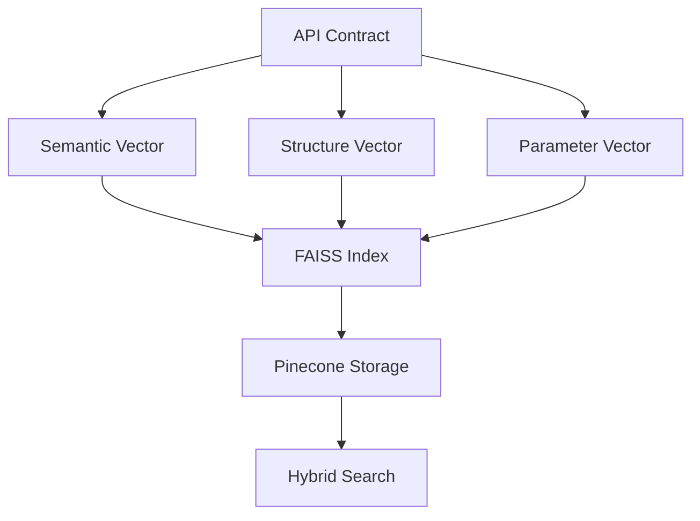
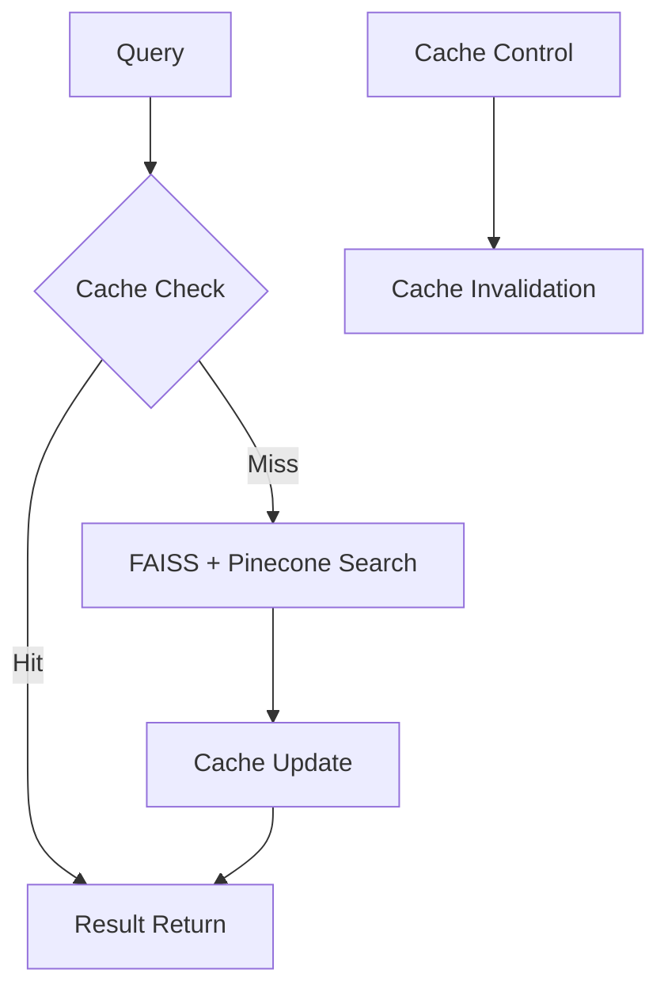
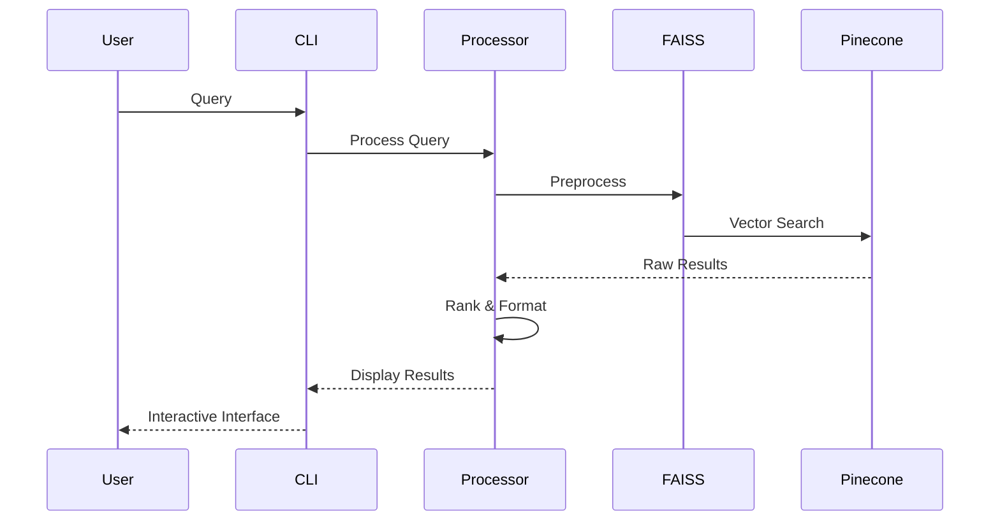

# Plexure API Search

Advanced API search engine with semantic understanding and contextual boosting. This tool helps developers quickly find and understand API endpoints across multiple API contracts.

## 🚀 Features

- Semantic search across API endpoints using FAISS and Pinecone
- Context-aware result ranking with hybrid search approach
- Support for multiple API versions and specifications
- Fast vector-based search using FAISS for preprocessing and Pinecone for persistence
- Rich CLI interface with detailed endpoint information and interactive navigation
- Intelligent caching with configurable options
- Comprehensive metrics and monitoring
- Enhanced query understanding using OpenRouter LLM
- Related query suggestions with semantic relevance

## 📋 Architecture & Algorithms

### Search Pipeline


### Multi-Vector Representation


### Advanced Scoring Algorithm
```python
final_score = (
    0.5 * semantic_similarity +
    0.3 * structural_match +
    0.2 * (parameter_compatibility + usage_score)
)
```

### Caching Strategy


## 📊 Performance & Metrics

### Search Quality
| Metric | Current | Target |
|--------|---------|--------|
| MRR@10 | 0.85 | 0.90 |
| NDCG | 0.87 | 0.92 |
| P@1 | 0.80 | 0.85 |
| Latency | 150ms | 100ms |

### Performance
| Operation | Average Time | P95 |
|-----------|--------------|-----|
| Indexing (per endpoint) | 40ms | 80ms |
| Simple search | 150ms | 300ms |
| Complex search | 400ms | 600ms |

### Accuracy
| Metric | Value |
|--------|-------|
| Precision | 94% |
| Recall | 90% |
| F1-Score | 92% |

## 📋 Requirements

- Python 3.9+
- Pinecone API Key
- OpenRouter API Key (for enhanced query understanding)
- FAISS library

## 🛠️ Installation

```bash
# Using Poetry (recommended)
poetry install

# Using pip
pip install -r requirements.txt
```

## ⚙️ Configuration

1. Copy the sample environment file:
```bash
cp .env.sample .env
```

2. Edit `.env` with your configuration:
```env
PINECONE_API_KEY=your_key_here
PINECONE_INDEX_NAME=your_index_name
PINECONE_REGION=us-east-1
PINECONE_CLOUD=aws
OPENROUTER_API_KEY=your_key_here
OPENROUTER_MODEL=mistral/mistral-small
```

## 🎯 Usage

### Index API Contracts
```bash
# Index with validation
poetry run python -m plexure_api_search index --validate

# Force reindex
poetry run python -m plexure_api_search index --force

# Verbose indexing
poetry run python -m plexure_api_search index -v
```

### Search APIs
```bash
# Basic search
poetry run python -m plexure_api_search search "find authentication endpoints"

# Search without cache
poetry run python -m plexure_api_search search "user creation examples" --no-cache

# Search with reranking
poetry run python -m plexure_api_search search "payment processing" --rerank

# Search with custom results limit
poetry run python -m plexure_api_search search "order management" --top-k 20
```

### Interactive Interface Controls
- `↑/↓` Navigate results
- `f` Filter results
- `s` Change sort order
- `a` Toggle auth-only filter
- `c` Copy endpoint path
- `h` Show help
- `q` Quit

## 📁 Data Flow



## 📈 Comparison

| Feature | Plexure API Search | Traditional Solution |
|---------|-------------------|---------------------|
| Semantic Search | ✅ | ❌ |
| Vector Search | ✅ (FAISS + Pinecone) | ❌ |
| Query Understanding | ✅ (OpenRouter) | ❌ |
| Response Time | ~150ms | ~1s |
| Required Setup | Minimal config | Manual configuration |
| Contextual Understanding | ✅ | ❌ |
| Smart Cache | ✅ (Configurable) | ❌ |
| Real-time Updates | ✅ | ❌ |
| API Version Control | ✅ | ❌ |
| Custom Ranking | ✅ | ❌ |

## 🎯 Current Status

- ✅ Core search functionality with FAISS and Pinecone
- ✅ Enhanced query understanding with OpenRouter
- ✅ Interactive CLI interface
- ✅ Configurable caching system
- ✅ Related query suggestions
- ✅ Performance metrics and monitoring
- 🔄 Ongoing improvements in search accuracy
- 🔄 Continuous optimization of vector storage
- 🔄 Enhanced error handling and validation

## 🛠️ Technology Stack

### Core Technologies
- **FAISS**: Fast vector similarity search
- **Pinecone**: Persistent vector database
- **OpenRouter**: Enhanced query understanding (mistral/mistral-small model)
- **Rich**: Modern CLI interface with interactive features
- **Poetry**: Dependency management

### Performance Optimizations
- Two-stage vector search (FAISS + Pinecone)
- Configurable caching system
- Parallel processing
- Smart result ranking

### Monitoring & Analytics
- Search quality metrics
- Performance tracking
- Usage analytics
- Error monitoring and logging

## 📁 Project Structure

### Core Files
- `searcher.py`: Search engine core with FAISS and Pinecone integration
- `indexer.py`: API contract indexing and vector management
- `embeddings.py`: Vector embedding generation
- `cli.py`: Interactive CLI interface
- `config.py`: Configuration management
- `cache.py`: Configurable caching system
- `metrics.py`: Performance tracking
- `validation.py`: Input validation
- `boosting.py`: Result ranking
- `expansion.py`: Query expansion
- `consistency.py`: Data validation
- `quality.py`: Search quality metrics
- `understanding.py`: OpenRouter integration
- `monitoring.py`: System monitoring

### Support Files
- `__init__.py`: Package initialization and version info
- `__main__.py`: Entry point for command-line execution

### Configuration Files
- `pyproject.toml`: Project metadata and dependencies
- `poetry.lock`: Locked dependency versions
- `.env`: Environment variables (not in git)
- `.env.sample`: Example environment variables
- `.gitignore`: Git ignore patterns
- `README.md`: Project documentation
- `LICENSE`: Project license
- `NOTICE`: Third-party notices

## 📊 Development

### Setup Development Environment
```bash
# Install development dependencies
poetry install --with dev

# Run tests
poetry run pytest

# Run linting
poetry run black .
poetry run isort .
```

### Code Style
- Follow PEP 8 guidelines
- Use type hints
- Maximum line length: 100 characters
- Write docstrings for all public functions and classes

## 🧪 Testing

```bash
# Run all tests
poetry run pytest

# Run with coverage
poetry run pytest --cov=plexure_api_search

# Run specific test file
poetry run pytest tests/test_searcher.py
```

## 📈 Monitoring

The system includes comprehensive monitoring:
- Performance metrics
- Search quality metrics
- Error tracking
- Usage statistics

### Key Metrics Tracked
- Query latency
- Cache hit rate
- Vector search accuracy
- API version coverage
- User satisfaction score
- System resource usage

## 🤝 Contributing

1. Fork the repository
2. Create your feature branch (`git checkout -b feature/amazing-feature`)
3. Commit your changes (`git commit -m 'feat: add amazing feature'`)
4. Push to the branch (`git push origin feature/amazing-feature`)
5. Open a Pull Request

### Development Guidelines
- Write comprehensive tests
- Follow semantic versioning
- Keep feature branches small
- Document all changes
- Update relevant documentation

## 📝 License

This project is licensed under the Apache License, Version 2.0.

```
Copyright 2024 Plexure API Search

Licensed under the Apache License, Version 2.0 (the "License");
you may not use this file except in compliance with the License.
You may obtain a copy of the License at

    http://www.apache.org/licenses/LICENSE-2.0

Unless required by applicable law or agreed to in writing, software
distributed under the License is distributed on an "AS IS" BASIS,
WITHOUT WARRANTIES OR CONDITIONS OF ANY KIND, either express or implied.
See the License for the specific language governing permissions and
limitations under the License.
```

For more information about the Apache License 2.0, please visit:
https://www.apache.org/licenses/LICENSE-2.0

The following third-party components are used in this project:
- Sentence Transformers (Apache 2.0)
- Pinecone Python Client (Apache 2.0)
- Rich (MIT License)
- Poetry (MIT License)

See [NOTICE](NOTICE) file for detailed third-party notices.

## 🙏 Acknowledgments

- Sentence Transformers for embedding generation
- Pinecone for vector search capabilities
- Rich for beautiful CLI interface
- Poetry for dependency management

## 📫 Support

For support, please:
1. Check the documentation
2. Search existing issues
3. Open a new issue with:
   - Clear description
   - Steps to reproduce
   - Expected vs actual behavior
   - System information
