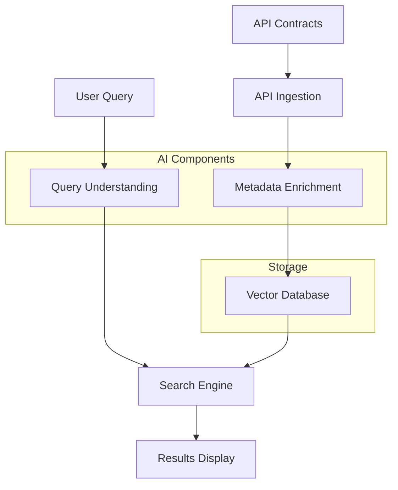
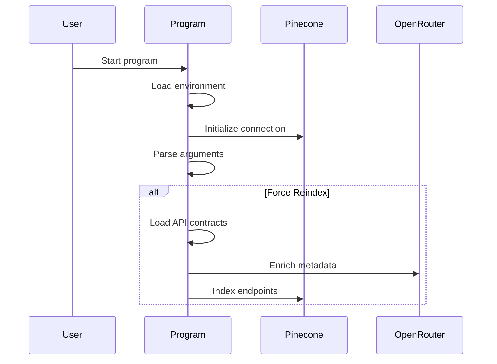
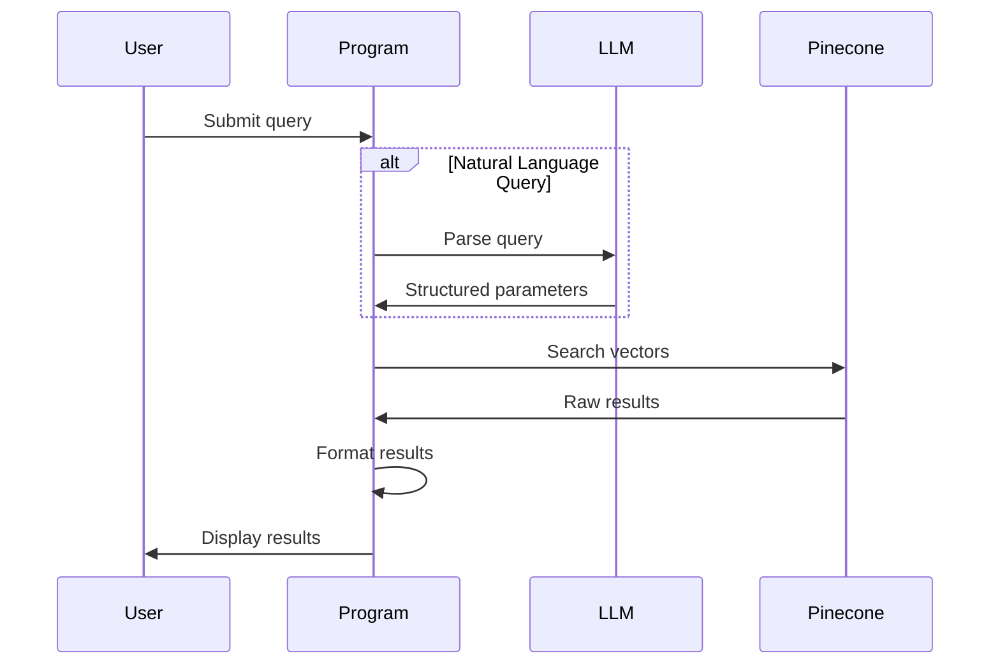

# Plexure API Search

A powerful semantic search tool for API contracts with natural language understanding and rich visualization.

## 🏗️ Architecture & Program Flow

### System Components



### Program Flow

1. **Initialization Phase**


2. **Search Phase**


### Data Flow

1. **API Contract Processing**
```
YAML File → Parse Contract → Extract Endpoints → Enrich Metadata → Index
```

2. **Query Processing**
```
User Query → Natural Language Understanding → Structured Query → Vector Search → Format Results
```

3. **Metadata Enrichment**
```
Raw Endpoint → LLM Analysis → Enhanced Documentation → Validation → Storage
```

## Features

### 🔍 Smart Search
- Semantic search using sentence transformers
- Natural language query understanding
- Hybrid search combining vector similarity and metadata filters
- Custom ranking based on multiple relevance factors
- Support for version-specific searches

### 🤖 LLM-Enhanced Analysis
- Query intent analysis
- Detailed relevance explanations
- Smart result summaries
- API metadata enrichment
- Contextual suggestions

### 📊 Rich Visualization
- Color-coded HTTP methods
- Feature icons and badges
- Formatted parameter tables
- Markdown support for descriptions
- Comprehensive result panels

### 🛠️ Technical Features
- Vector embeddings with all-MiniLM-L6-v2
- Pinecone vector database integration
- OpenRouter LLM integration
- YAML/OpenAPI contract parsing
- Batch processing support

### Error Handling

The system implements robust error handling at multiple levels:

1. **API Ingestion**
   - Invalid YAML handling
   - Missing file detection
   - Contract validation

2. **LLM Integration**
   - Retry mechanism (3 attempts)
   - JSON validation
   - Fallback to synthetic data
   - Rate limiting handling

3. **Search Operations**
   - Query validation
   - Score thresholding
   - Results sanitization

4. **Vector Operations**
   - Connection error handling
   - Index validation
   - Upsert batching

### Performance Considerations

1. **Indexing**
   - Batch processing for efficiency
   - Parallel enrichment where possible
   - Incremental updates support

2. **Search**
   - Query optimization
   - Result caching
   - Hybrid search balancing

3. **Resource Usage**
   - Connection pooling
   - Memory-efficient processing
   - Timeout handling

## Installation

1. Clone the repository:
```bash
git clone https://github.com/felipepimentel/plexure-api-search.git
cd plexure-api-search
```

2. Install dependencies:
```bash
pip install -r requirements.txt
```

3. Configure API keys in `constants.py`:
```python
OPENROUTER_API_KEY = "your_key_here"
PINECONE_API_KEY = "your_key_here"
```

## Usage

### Command Line Interface

1. Index API contracts:
```bash
# Index with default settings
python -m plexure_api_search index

# Force reindex
python -m plexure_api_search index --force-reindex

# Custom API directory
python -m plexure_api_search index --api-dir /path/to/apis
```

2. Search APIs:
```bash
# Basic search
python -m plexure_api_search search "find authentication endpoints"

# Direct module usage
python -m plexure_api_search.searcher "find user management APIs"
```

### Module Structure

```
plexure_api_search/
├── __init__.py
├── __main__.py      # Main entry point
├── constants.py     # Configuration and constants
├── indexer.py       # API ingestion and indexing
└── searcher.py      # Search and display functionality
```

### Configuration

Key configurations in `constants.py`:

```python
# Model Settings
SENTENCE_TRANSFORMER_MODEL = "all-MiniLM-L6-v2"
LLM_MODEL = "mistralai/mistral-7b-instruct"

# Search Settings
DEFAULT_TOP_K = 5
SCORE_ADJUSTMENTS = {
    'version_match': 0.3,
    'method_match': 0.2,
    'path_match': 0.15,
    'feature_match': 0.1,
    'metadata_match': 0.1
}

# Visual Settings
METHOD_COLORS = {
    'GET': 'green',
    'POST': 'blue',
    'PUT': 'yellow',
    # ...
}
```

## Features in Detail

### Query Analysis
The tool analyzes natural language queries to understand:
- Primary and secondary search goals
- Required API versions
- HTTP method preferences
- Feature requirements
- Authentication needs
- Pagination preferences

### Result Ranking
Results are ranked based on multiple factors:
- Vector similarity score
- Version match
- Method match
- Path relevance
- Feature matches
- Metadata filters

### Result Display
Each result includes:
- Method and path with color coding
- Version information
- Relevance score and explanation
- Feature badges
- Parameter details
- Tags and metadata
- Natural language description

### Summary Generation
The tool provides:
- Overview of total results
- Version distribution
- Method distribution
- Feature patterns
- Refinement suggestions

### API Contract Format

The search engine expects API contracts in YAML format following the OpenAPI/Swagger specification. Example:

```yaml
openapi: 3.0.0
info:
  title: User Management API
  version: 1.0.0
  description: API for managing user accounts
paths:
  /users:
    get:
      summary: List users
      description: Retrieve a list of users
      responses:
        200:
          description: Success
```

## Contributing

1. Fork the repository
2. Create your feature branch (`git checkout -b feature/amazing-feature`)
3. Commit your changes (`git commit -m 'Add amazing feature'`)
4. Push to the branch (`git push origin feature/amazing-feature`)
5. Open a Pull Request

## License

This project is licensed under the MIT License - see the LICENSE file for details.

## Acknowledgments

- [Sentence Transformers](https://www.sbert.net/) for embeddings
- [Pinecone](https://www.pinecone.io/) for vector search
- [OpenRouter](https://openrouter.ai/) for LLM integration
- [Rich](https://rich.readthedocs.io/) for terminal formatting
