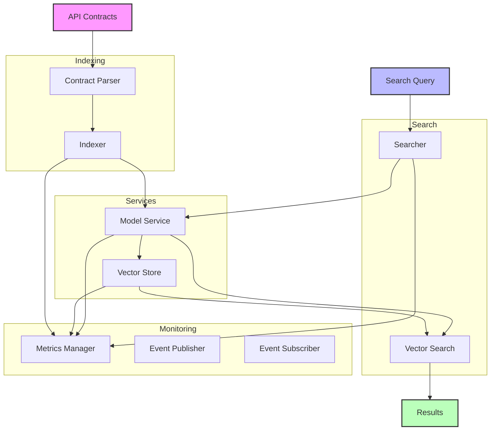
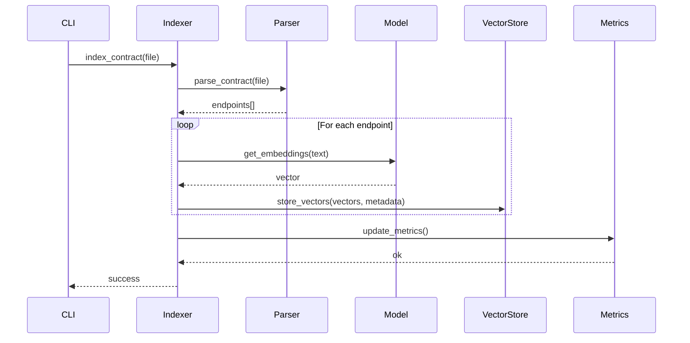
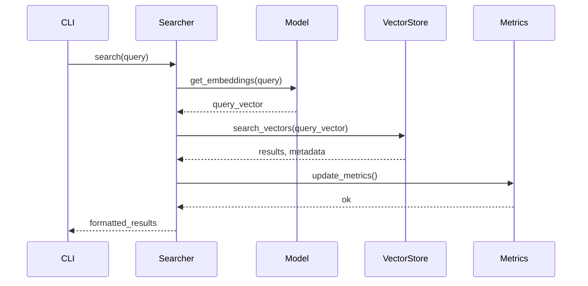

# Plexure API Search 🔍

> A semantic search engine for API contracts using advanced NLP techniques and vector embeddings.

[](https://www.python.org/downloads/)
[](https://python-poetry.org/)
[](LICENSE)

## 🌟 Features

- 🔍 Semantic search over API endpoints using state-of-the-art language models
- 🚀 High-performance vector similarity search with FAISS
- 📊 Efficient vector storage and retrieval
- 🔄 Automatic metadata association and retrieval
- 🎯 Configurable similarity thresholds and search parameters
- 📈 Built-in monitoring and metrics collection
- 💾 Efficient caching system for improved performance
- 🔒 Support for multiple API contract formats (OpenAPI/Swagger)

## 🏗️ Architecture

The system is built with a modular architecture focusing on maintainability and performance:



### 🔄 Data Flow

1. **Indexing Pipeline**:



2. **Search Pipeline**:



### 🧠 Core Components

#### Vector Store (FAISS)

- Inner Product similarity metric
- ID mapping for endpoint metadata
- Normalized L2 vectors
- AVX2 optimizations

#### Embedding Model

- Default: `sentence-transformers/all-MiniLM-L6-v2` (384d)
- Normalized embeddings
- Batched processing support
- Configurable through environment variables

#### Monitoring System

- Prometheus metrics integration
- Custom event system for tracking
- Performance monitoring
- Resource utilization tracking

## 🚀 Getting Started

### Prerequisites

- Python 3.9+
- Poetry for dependency management

### Installation

```bash
# Clone the repository
git clone https://github.com/yourusername/plexure-api-search.git
cd plexure-api-search

# Install dependencies
poetry install
```

### Usage

1. **Index API Contracts**:

```bash
# Clear existing index and re-index
poetry run python -m plexure_api_search index --clear

# Index without clearing
poetry run python -m plexure_api_search index
```

2. **Search Endpoints**:

```bash
# Basic search
poetry run python -m plexure_api_search search "find authentication endpoints"

# Search with limit
poetry run python -m plexure_api_search search "create user" --top-k 5
```

### Configuration

Configuration is managed through environment variables and `.env` files:

```bash
# Environment
ENVIRONMENT=development  # development, staging, production
DEBUG=false

# Paths
API_DIR=assets/apis
CACHE_DIR=.cache/default
METRICS_DIR=.cache/metrics

# Model
MODEL_NAME=sentence-transformers/all-MiniLM-L6-v2
MODEL_DIMENSION=384
MODEL_BATCH_SIZE=32
MODEL_NORMALIZE_EMBEDDINGS=true

# Monitoring
ENABLE_TELEMETRY=true
METRICS_BACKEND=prometheus
PUBLISHER_PORT=5555

# Search
MIN_SCORE=0.1
TOP_K=10
EXPAND_QUERY=true
RERANK_RESULTS=true

# Logging
LOG_LEVEL=INFO
```

## 📊 Performance Metrics

The system collects various metrics through the Prometheus integration:

### Counters

- `embeddings_generated_total`: Total number of embeddings generated
- `embedding_errors_total`: Total number of embedding errors
- `searches_performed_total`: Total number of searches performed
- `search_errors_total`: Total number of search errors
- `contract_errors_total`: Total number of contract errors

### Gauges

- `index_size`: Number of vectors in index
- `metadata_size`: Number of metadata entries

### Histograms

- `search_latency_seconds`: Search latency in seconds
- `embedding_latency_seconds`: Embedding latency in seconds

## 🔬 Technical Details

### Project Structure

```
plexure_api_search/
├── cli/                # Command-line interface
│   └── commands/      # CLI commands
├── config/            # Configuration management
├── indexing/          # API contract indexing
│   ├── indexer.py    # Indexing logic
│   └── parser.py     # Contract parsing
├── monitoring/        # Metrics and monitoring
│   └── metrics.py    # Metrics management
├── search/           # Search functionality
│   └── searcher.py   # Search logic
└── services/         # Core services
    ├── events.py     # Event system
    ├── models.py     # Embedding models
    └── vector_store.py  # FAISS integration
```

### Key Features

1. **Singleton Pattern**

   - Used for configuration, metrics, and service management
   - Ensures consistent state across components
   - Proper cleanup and initialization

2. **Vector Storage**

   - FAISS IndexIDMap for efficient retrieval
   - Metadata association with vectors
   - Persistent storage with automatic loading/saving

3. **Monitoring**

   - Prometheus metrics integration
   - Event system for tracking operations
   - Comprehensive error logging

4. **Search Quality**
   - Semantic similarity scoring
   - Metadata-enriched results
   - Configurable result limits

## 🔧 Development

### Testing

```bash
# Run tests
poetry run pytest

# Run with coverage
poetry run pytest --cov=plexure_api_search
```

### Code Style

- Follow PEP 8 guidelines
- Use type hints
- Document public interfaces
- Keep functions focused and single-purpose

## 📈 Future Improvements

1. **Search Enhancements**

   - Query expansion
   - Result reranking
   - Faceted search

2. **Performance**

   - Batch processing optimization
   - Caching improvements
   - Parallel processing

3. **Features**
   - API versioning support
   - Schema validation
   - Custom scoring functions

## 📝 License

This project is licensed under the MIT License - see the [LICENSE](LICENSE) file for details.

## 🙏 Acknowledgments

- FAISS team at Facebook Research
- Sentence Transformers by UKP Lab
- The amazing open-source community

---

Made with ❤️ by Your Team
